# Configuración de un servidor de correo

# Paso 1

Agregar los dispositivos a la hoja de trabajo. Usaremos un servidor, un switch y dos laptops.

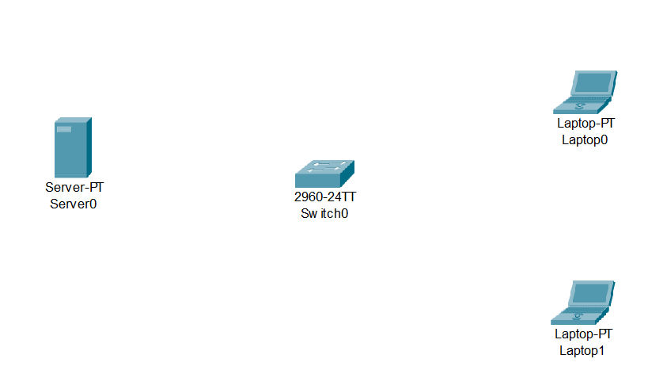

Seguidamente hacer las conexiones entre estos dispositivos

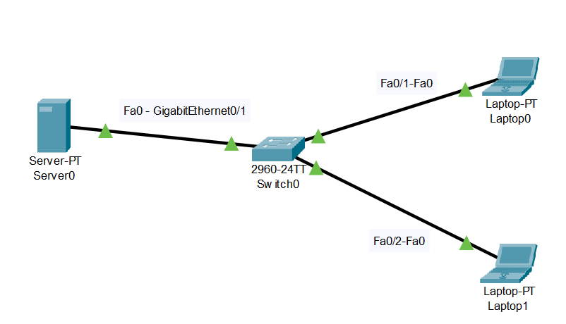

# Paso 2
 
Asignar la dirección IP del servidor y del DNS server

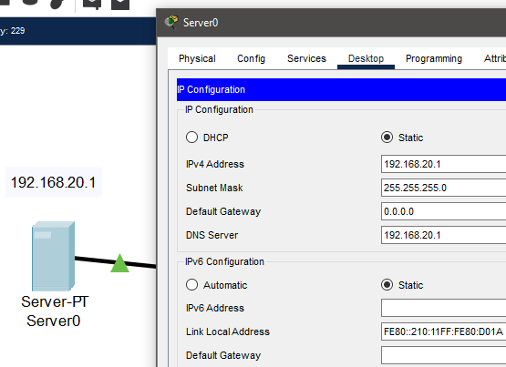

Posteriormente irnos al apartado de DHCP para asignarle la dirección de IP y hacer la configuración y lo guardamos dandole al botón "Save"

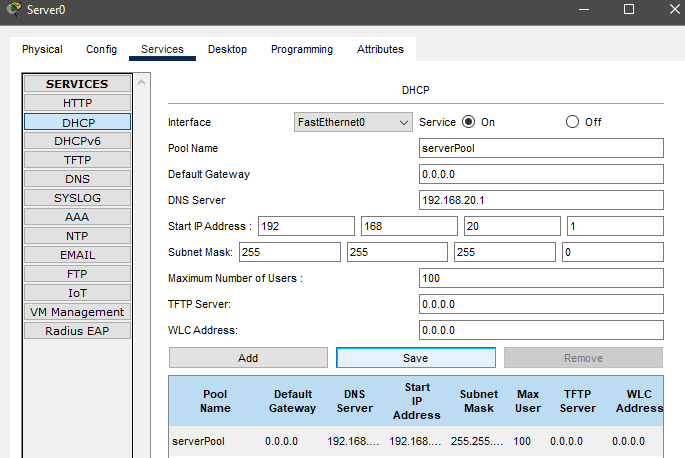

Luego nos dirigimos a Email, creamos el nombre del dominio que en este caso será "gatos.com" y a cada dispositivo le colocamos un usuario y contraseña

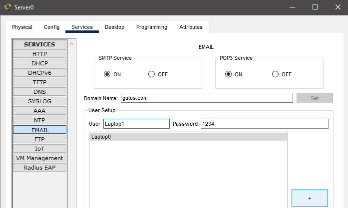

Luego nos vamos a las Laptops y en IP seleccionamos DHCP

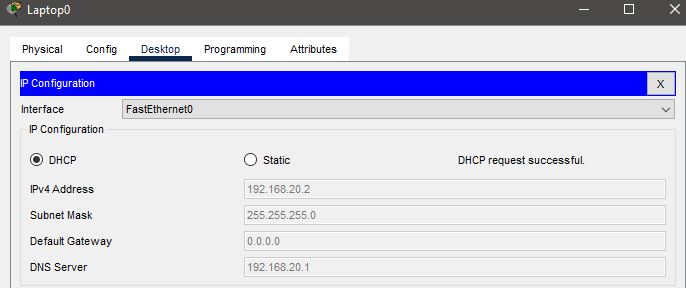

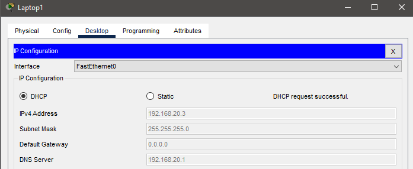

Ahora nos digirimos a configuración de Email y llenamos los datos correspondientes 

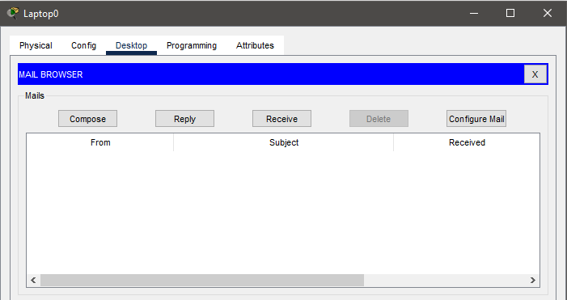

# Paso 3

Finalmente para comprobar que está todo bien hacemos la prueba enviando un correo desde la laptop0 a la laptop1 haciendo lo siguiente:
1. Le damos a "Compose"

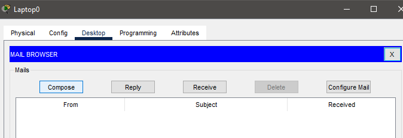

3. Llenamos los datos y el mensaje que queremos enviar y lo enviamos dandole al botón "Send"

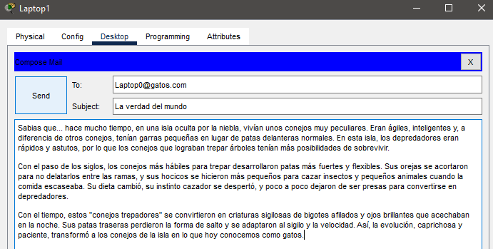

3. Nos dirigimos al otro dispositivo, a la laptop1, y en "receive" debería mostrarse el correo de la Laptop0

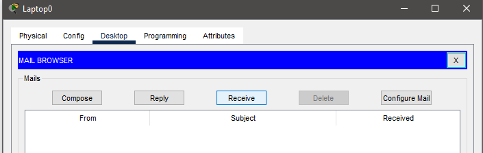

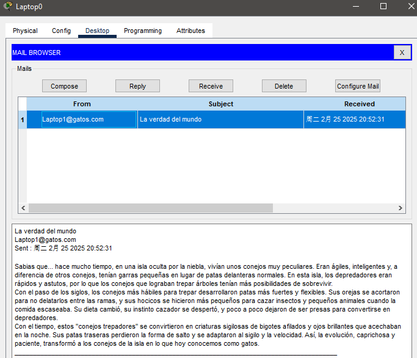
